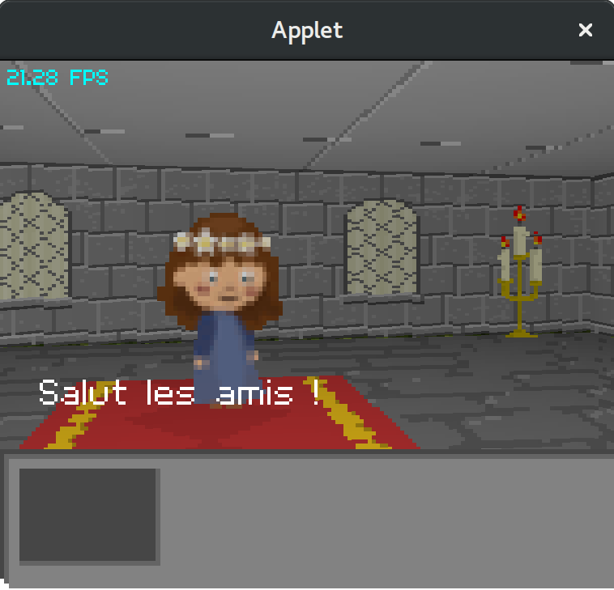
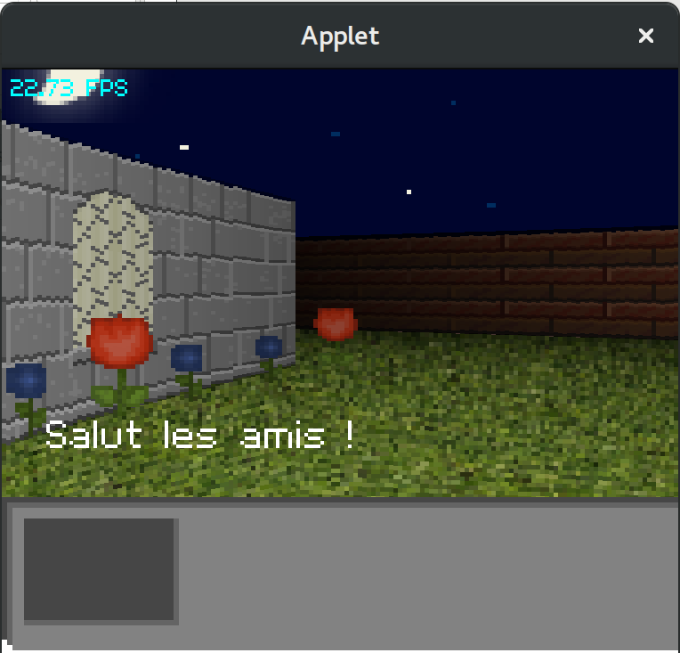

# Raycast World

This is a Raycasting project to learn a bit of clojure.

Performances are poor as I draw pixel by pixel.

Will probably rewrite it using OpenGL textures if I figure out how to do it.

 

# Usage

with Leiningen :

`lein run`
